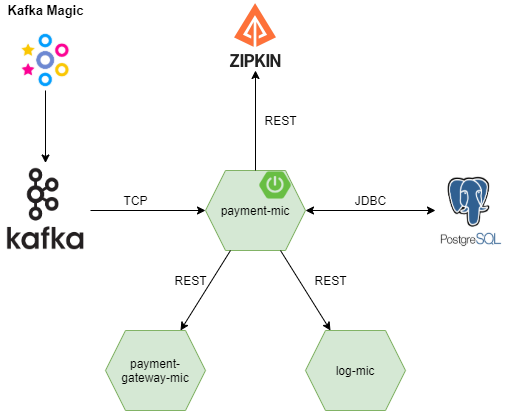
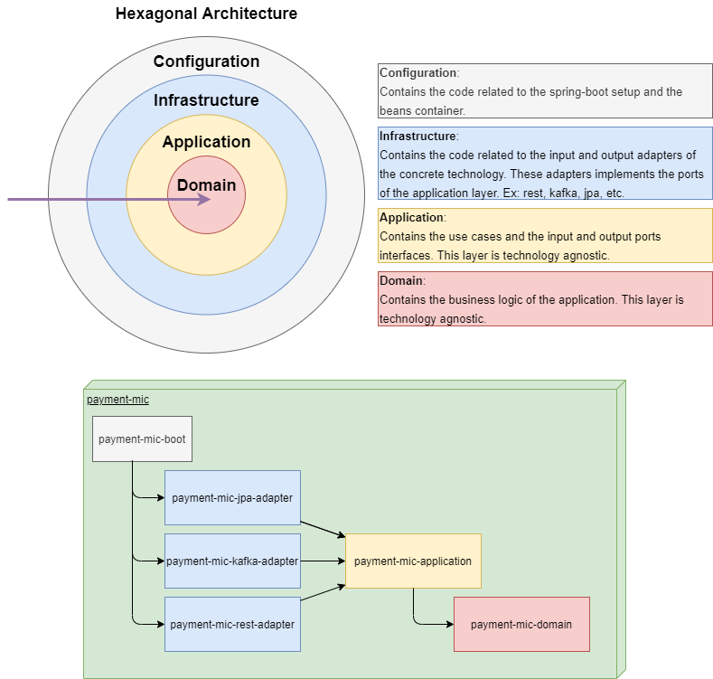

# Challenge

## :computer: How to execute

To run this project we need to do three steps:
1. Run the infrastructure with docker-compose:
    ``` cmd 
    WefoxEngineerChallenge> docker-compose up -d  
    ```
2. Run the spring-boot project:
    ``` cmd
    WefoxEngineerChallenge> cd .\payments-mic
    WefoxEngineerChallenge\payments-mic> .\mvnw -f .\payments-mic-boot\ spring-boot:run -D "spring-boot.run.arguments=--spring.datasource.password=test"
    ```
3. Open the navigator and put the URL: `http://localhost:9000/start`

  
## :memo: Notes

### Architecture diagram


### Payment-mic code structure


### Architecture decisions
* [Technology stack](./docs/adrs/ADR1%20technology%20stack.md)
* [Code structure](./docs/adrs/ADR2%20code%20structure.md) 
* [Observability](./docs/adrs/ADR3%20observability%20tool.md)

## :pushpin: Things to improve

### Overall solution
* Add versioning to the APIs.
* Use AsyncAPI to create a contract for the kafka publications, using an schema definition for the payloads like Avro.
* Asynchronous communication with the log service using a broker to decrease the coupling and improve the availability.
* Add more partitions to the payment topics to enable the parallel consuming. Use the paymentId as publication key to achieve the ordering guarantee.
* Add many payment-mic instances as partitions to increase the throughput.

### The payment-mic
* Generate the rest clients through the OpenAPI specification.
* Use an end-to-end reactive stack to improve the resource utilization.
* Add integration tests to the jpa repositories using [Testcontainers](https://www.testcontainers.org/modules/databases/postgres/).
* Add integration tests to the kafka consumers.
* Add a consumer to the kafka DLQ topics to process the payments with errors.